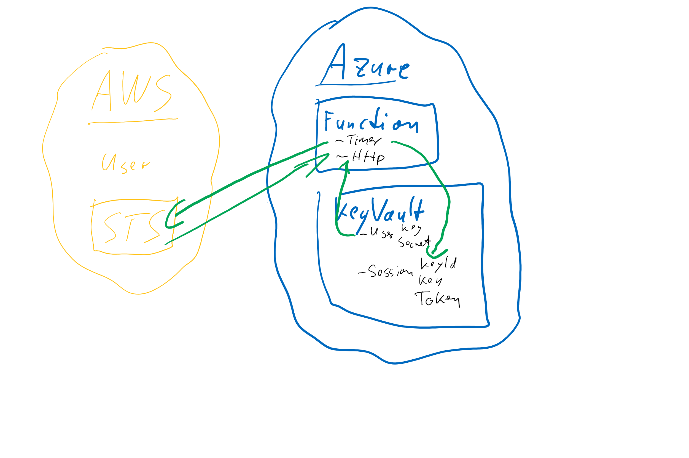
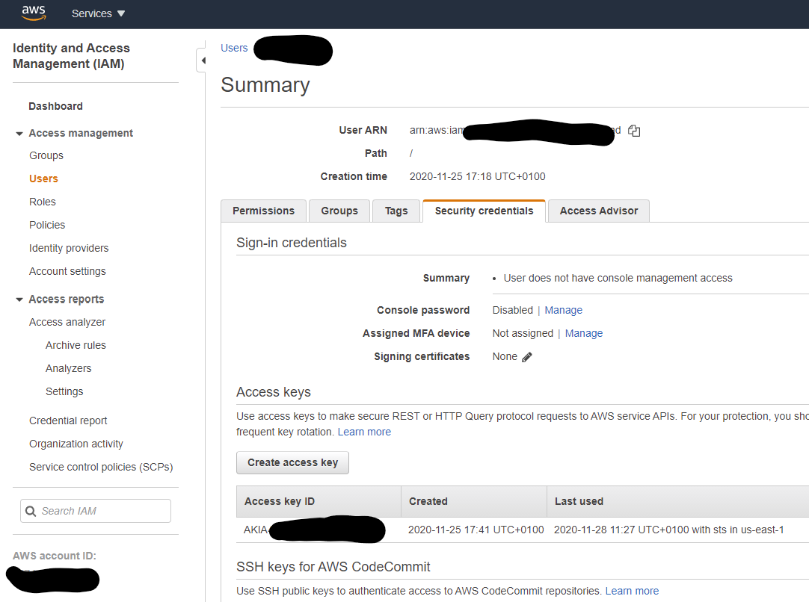
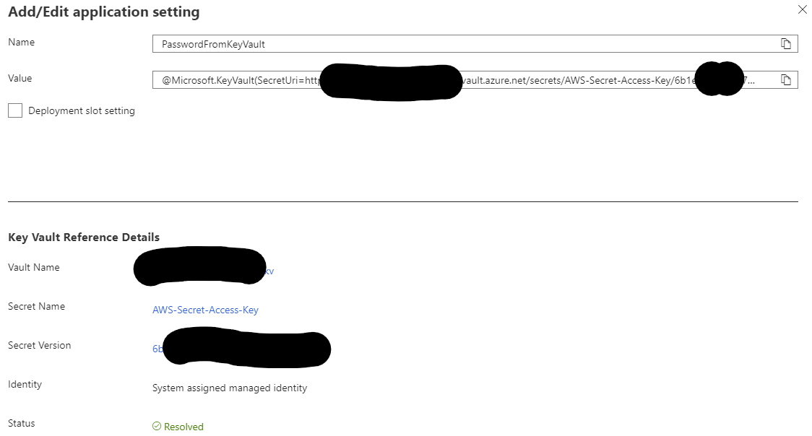

# Renew AWS SessionToken and store values in Azure KeyVault
This sample contains an Azure Function (actually two: one is called via Timer every hour, the other one is for manual trigger via HTTP) that uses an AWS user to create Session Tokens.



**Please use this code as sample only and give me feedback in order to improve the sample**

## AWS User
For an existing user create an Access Key that will be used to connect to the STS in order to get a temporary session token. This token will have the same permissions as the user.



The access key ID is stored as *AWS-Access-Key-ID* in KeyVault and the corresponding key as *AWS-Secret-Access-Key*.

## Azure KeyVault
KeyVault stores 5 secrets:

- AWS-Access-Key-ID
- AWS-Secret-Access-Key
- AccessKeyId
- SecretAccessKey
- SessionToken

The first two are used to connect to the AWS STS service to get SessionTokens, while the other tree take the current values that can be used by other services to connect to Azure. They will be regenerated every hour (configurable in the timer Function).

## Azure Function
The Function App needs to be able to get and update secrets from KeyVault. For that, configure it to use a Managed Identity and grant access to it on KeyVault. A general tutorial can be found on [this great post](https://daniel-krzyczkowski.github.io/Integrate-Key-Vault-Secrets-With-Azure-Functions/).

### App Settings
After creating the system assigned identity and granting permissions in KeyVault the App Service can fetch the secrets by adding the two settings *UsernameFromKeyVault* and *PasswordFromKeyVault*.



### local debugging of the Azure Function
For local debugging you do not use the AWS secrets stored in KeyVault, but instead use credentials stored in plain text in ```local.settings.json```. Set *PlainUsername* and *PlainPassword*.
```json
{
  "IsEncrypted": false,
  "Values": {
    "AzureWebJobsStorage": "DefaultEndpointsProtocol=https;AccountName=...;AccountKey=...;EndpointSuffix=core.windows.net",
    "FUNCTIONS_WORKER_RUNTIME": "dotnet",
    "UsernameFromKeyVault": "https://....vault.azure.net/secrets/AWS-Access-Key-ID/...",
    "PasswordFromKeyVault": "https://g....vault.azure.net/secrets/AWS-Secret-Access-Key/...",
    "KeyVaultUrl": "https://....vault.azure.net",

    "AccessKeyIdFromKeyVault": "https://....vault.azure.net/secrets/AccessKeyId/...",
    "SecretAccessKeyFromKeyVault": "https://....vault.azure.net/secrets/SecretAccessKey/...",
    "SessionTokenFromKeyVault": "https://....vault.azure.net/secrets/SessionToken/...",

    "PlainUsername": "AKIA...",
    "PlainPassword": "..."
  }
}
```

## Links
- [Integrate Key Vault Secrets With Azure Functions](https://daniel-krzyczkowski.github.io/Integrate-Key-Vault-Secrets-With-Azure-Functions/)
- [Get Session Token](https://docs.aws.amazon.com/STS/latest/APIReference/API_GetSessionToken.html)
- [Making requests using IAM user temporary credentials - AWS SDK for .NET](https://docs.aws.amazon.com/AmazonS3/latest/dev/AuthUsingTempSessionTokenDotNet.html)
